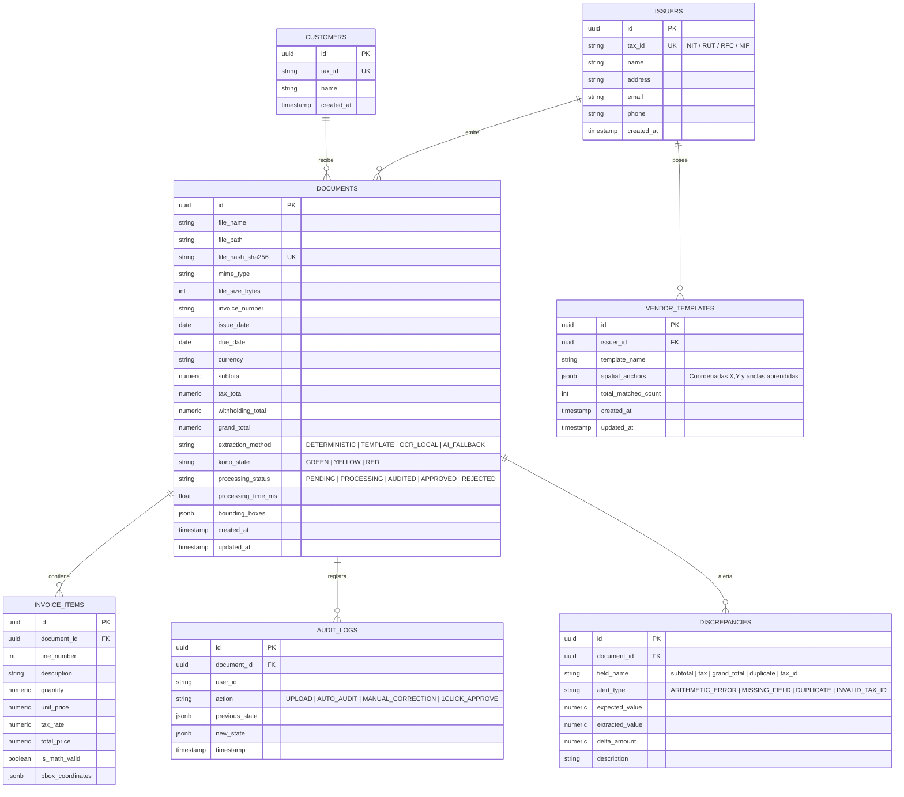

# Especificación de Esquema de Base de Datos: Kono.ai (v0)

**Motor:** SQLite (Desarrollo / Local) / PostgreSQL 15+ (Producción)  
**ORM:** SQLAlchemy 2.0 (Async) + Alembic para migraciones.

---

## 1. Diagrama Entidad-Relación (ERD)



---

## 2. Definición DDL (SQLAlchemy Core / PostgreSQL / SQLite)

### 2.1 Tabla: `documents`
Almacena el registro maestro de cada comprobante o factura procesada.
- `id` (UUID): Identificador único global.
- `file_hash_sha256` (VARCHAR(64), UNIQUE, INDEX): Clave de deduplicación instantánea (< 1 ms).
- `extraction_method` (VARCHAR(20)): Registra si el documento costó $0 (`DETERMINISTIC`, `TEMPLATE`, `OCR_LOCAL`) o si usó fallback (`AI_FALLBACK`).
- `kono_state` (VARCHAR(10)): `GREEN`, `YELLOW`, `RED`.
- `bounding_boxes` (JSON / JSONB): Almacena las coordenadas exactas `[x0, y0, x1, y1]` de cada campo para el visor split-screen.

### 2.2 Tabla: `vendor_templates`
Almacena la memoria espacial de Kono.ai para proveedores recurrentes.
```json
{
  "invoice_number": { "anchor": "Factura N°", "direction": "right", "offset_x": 10, "offset_y": 0, "regex": "([A-Z0-9-]+)" },
  "issue_date": { "anchor": "Fecha Emisión", "direction": "right", "format": "DD/MM/YYYY" },
  "subtotal": { "anchor": "Subtotal", "direction": "right", "is_currency": true },
  "tax_total": { "anchor": "IVA (19%)", "direction": "right", "is_currency": true },
  "grand_total": { "anchor": "TOTAL A PAGAR", "direction": "right", "is_currency": true }
}
```

### 2.3 Índices para Alta Velocidad
- `CREATE UNIQUE INDEX idx_documents_file_hash ON documents(file_hash_sha256);`
- `CREATE INDEX idx_documents_kono_state ON documents(kono_state, processing_status);`
- `CREATE INDEX idx_documents_issuer_invoice ON documents(issuer_id, invoice_number);`
