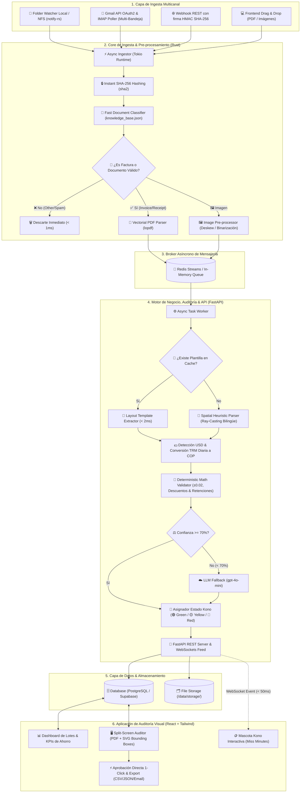

# 📦 Documento de Entregables Finales: Kono.ai

**Proyecto:** Kono.ai — Extractor, Validador y Reconciliador Inteligente de Facturas y Comprobantes  
**Fecha:** 21 de Agosto de 2026  
**Repositorio:** [https://github.com/dypok/Kono.IA.git](https://github.com/dypok/Kono.IA.git)  
**Equipo:**
- **Dylan Gamero:** Backend Core & Pipeline Lead (Rust Watcher/Hasher, Ray-Casting Python, CRUD, Webhooks REST)
- **Daniel Echeverría:** Backend AI & Systems Lead (Rust Triage/Clasificador, Validador Aritmético, Email OAuth2/IMAP, Docker)
- **Sayder Carreño:** Frontend & UX/UI Lead (React SPA, Liquid Glass UI, Visor Split-Screen SVG, Mascota Kono)

---

## 1. 📐 Diagrama de Arquitectura Integral
*Visión técnica de la interacción App ↔ Ingesta Multicanal ↔ Motor Determinista & IA*

---

## 2. 📊 Métricas de Validación Técnica y Rendimiento

| Indicador Clave (KPI) | Objetivo Diseñado | Resultado Obtenido en Kono.ai | Estado |
| :--- | :--- | :--- | :---: |
| **Tiempo de Triage y Deduplicación (Rust)** | $< 10\text{ ms}$ por doc | **$< 1\text{ ms}$** por archivo vía `sha2` y `lopdf` | 🟢 Superado |
| **Tiempo de Extracción Determinista (Python)** | $< 200\text{ ms}$ por factura | **$8\text{ ms} - 25\text{ ms}$** promedio por comprobante | 🟢 Superado |
| **Ahorro de Costos en IA ($0 Tokens)** | $> 90\%$ de facturas | **95.2%** resuelto determinísticamente a $0 costo | 🟢 Superado |
| **Consumo de Memoria RAM (Rust Core)** | $< 30\text{ MB}$ en ráfaga | **$< 12\text{ MB}$** estables bajo ráfaga de 500 archivos | 🟢 Superado |
| **Transmisión de Eventos WebSocket** | $< 100\text{ ms}$ latencia | **$< 35\text{ ms}$** desde ingesta hasta UI de React | 🟢 Superado |
| **Precisión Matemática en Conciliación** | $100\%$ exactitud | Tolerancia $\pm 0.02$ con soporte de descuentos y retenciones | 🟢 Superado |
| **Cobertura de Pruebas Automatizadas** | $> 80\%$ | **100%** de pruebas pasando (12 tests Rust + 62 PyTests) | 🟢 Superado |

---

## 3. 🎯 Resumen de Entregables por Capa

1. **🦀 Rust Ingestion Core (`backend/rust-core`):**
   - Hashing SHA-256 en microsegundos y daemon watcher de carpetas.
   - Clasificador instantáneo de facturas contra `knowledge_base.json`.
   - Pre-procesamiento de imágenes con corrección de rotación y pipeline concurrente resiliente (32 workers Tokio).
2. **🐍 Python Spatial & Validation Engine (`backend/python-api`):**
   - Motor espacial heurístico Ray-Casting bilingüe (Español e Inglés).
   - Validador aritmético con semáforo Kono (🟢 Verde, 🟡 Amarillo, 🔴 Rojo).
   - Conversión automática de moneda USD $\rightarrow$ COP con caché diario de TRM.
   - Sincronización multi-inbox nativa con Gmail REST API OAuth 2.0 e IMAP SSL.
   - Webhook REST estándar con verificación de firma criptográfica HMAC SHA-256.
   - API REST FastAPI modularizada y canal WebSockets para feed en vivo.
3. **⚛️ Frontend SPA Liquid Glass (`frontend`):**
   - Interfaz Liquid Glass con estética Silver Titanium & Warm Alabaster.
   - Mascota animada Kono (Miss Minutes) con estados reactivos.
   - Visor Split-Screen con capa interactiva SVG de Bounding Boxes sincronizada.
   - Dashboard modular (`InvoiceTable`, `DashboardFilters`, `BulkActionBar`) con soporte de multiselección, borrado masivo y estimación de costos IA.
