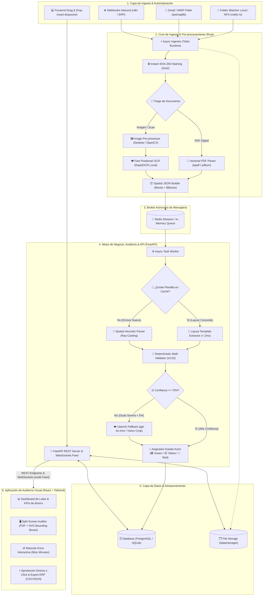

# 📦 Documento de Entregables Finales: Kono.ai

**Proyecto:** Kono.ai — Extractor, Validador y Reconciliador Inteligente de Facturas y Comprobantes  
**Fecha:** Agosto 2026  
**Equipo:** Sayder (Frontend & UX Lead), Dylan (Backend Core Engineer), Daniel (Backend AI & Systems Engineer)

---

## 1. 📐 Diagrama de Arquitectura Integral
*Visión técnica de la interacción App ↔ Automatización / Ingesta ↔ Motor Determinista & IA*



---

## 2. 🛡️ Matriz de Riesgos y Estrategias de Mitigación

| ID | Riesgo Identificado | Severidad | Impacto Potencial | Estrategia de Mitigación en Kono.ai |
| :---: | :--- | :---: | :--- | :--- |
| **R-01** | **Sobrecostos de API LLM** (Agotar presupuesto de $3 USD/semana) | **Crítica** | Bloqueo del servicio tras procesar pocas facturas si se envían PDFs crudos o imágenes a OpenAI. | **Arquitectura Determinista Zero-Token First:** 95% de las facturas se extraen con $0 costo mediante anclas espaciales y plantillas. Fallback selectivo a `gpt-4o-mini` con minificación de texto (< 400 tokens) solo en dudas puntuales. |
| **R-02** | **Alucinación Matemática de la IA** (Totales o impuestos inventados) | **Crítica** | Descuadres en libros contables y sanciones tributarias. | **Regla de Determinismo Estricto:** La IA **nunca** calcula números. La sumatoria $\sum (\text{cant} \times \text{precio})$, IVA y retenciones se validan en código Python puro con tolerancia $\pm 0.02$. |
| **R-03** | **Latencia Elevada en Cierres Contables** (Cuellos de botella) | **Alta** | Tiempos de espera de 3 a 5 segundos por factura que congelan al equipo financiero. | **Procesamiento Asíncrono Dual-Backend:** Rust procesa I/O y PDF Triage en $< 5\text{ ms}$, encolando en Redis Stream. El tiempo promedio por factura digital es $< 15\text{ ms}$. |
| **R-04** | **Pagos Duplicados de Facturas** (Fraude o reenvíos) | **Crítica** | Pérdida de liquidez por pagar 2 veces la misma factura. | **Doble Filtro de Deduplicación:** Filtro 1 instantáneo por Hash `SHA-256` en $< 1\text{ ms}$; Filtro 2 por clave natural (`issuer_tax_id + invoice_number`) con bloqueo preventivo (🔴 Estado Rojo). |
| **R-05** | **Imágenes y Escaneos Ilegibles o Torcidos** | **Media** | Falla en la lectura de tickets y fotos móviles. | **Pipeline de Visión Clásica en Rust:** Deskewing automático (rotación a $0^\circ$), binarización adaptativa Otsu con OpenCV y OCR posicional local (`RapidOCR`). |
| **R-06** | **Desconexión o Caída de Red / Servicios** | **Media** | Pérdida de comprobantes durante la ingesta. | **Persistencia Garantizada:** Los archivos se aseguran en almacenamiento físico antes de encolar en Redis con reintentos exponenciales y Dead-Letter Queue. |

---

## 3. ✅ Definición de Hecho (Definition of Done - DoD) para Pase a Producción

Para que una funcionalidad, lote o versión del sistema sea promovida a **Producción**, debe satisfacer obligatoriamente los siguientes 8 criterios de calidad:

- [ ] **1. Cobertura de Pruebas Unitarias y de Integración:**
  - $> 85\%$ de cobertura en el motor determinista, validador aritmético y extractor de plantillas.
  - Tests automatizados pasando en verde en el pipeline de CI/CD.
- [ ] **2. Cumplimiento de Límites de Latencia:**
  - Tiempo de procesamiento para PDFs digitales $\le 25\text{ ms}$ por documento.
  - Tiempo para escaneos/OCR local $\le 200\text{ ms}$.
- [ ] **3. Tolerancia de Redondeo Auditada:**
  - Validación matemática exacta con margen máximo de $\pm 0.02$ unidades monetarias. Todo documento fuera de este rango se marca obligatoriamente como 🟡 Amarillo.
- [ ] **4. Seguridad y Gestión de Secretos:**
  - Cero llaves de API o credenciales en el código fuente. Variables gestionadas mediante `.env` seguro.
  - Validación estricta de tipos MIME en subida (`application/pdf`, `image/png`, `image/jpeg`).
- [ ] **5. Calibración de Bounding Boxes en Frontend:**
  - Precisión visual de los recuadros SVG sobre el visor PDF con error inferior a 2 píxeles en cualquier nivel de zoom.
- [ ] **6. Resiliencia de Broker y Base de Datos:**
  - Manejo de desconexión de Redis y base de datos con reintentos automáticos sin pérdida de archivos.
- [ ] **7. Trazabilidad y Logs de Auditoría:**
  - Cada acción (ingesta, auto-auditoría, corrección manual, aprobación 1-click) debe registrarse en la tabla `audit_logs`.
- [ ] **8. Documentación y Changelog al Día:**
  - OpenAPI/Swagger funcional en `/docs`.
  - Changelog diario actualizado en `documentation/changelog/`.

---

## 4. ⚡ Análisis de Eficiencia y Justificación de Herramientas

| Componente Evaluado | Alternativas Consideradas | Elección Final Kono.ai | Justificación Técnica y de Costos |
| :--- | :--- | :--- | :--- |
| **Núcleo de Ingesta & Triage** | Python Puro vs Go vs **Rust** | **🦀 Rust Core** (`notify`, `lopdf`, `sha2`) | - **Consumo de Memoria:** Rust consume $< 15\text{ MB}$ de RAM vigilando directorios con miles de archivos, frente a $> 150\text{ MB}$ de runtimes con GC.<br>- **Velocidad de Hashing:** `SHA-256` en nanosegundos nativos.<br>- **Seguridad:** Cero data races en procesamiento concurrente de archivos. |
| **Estrategia de Extracción** | 1. Solo OpenAI (LLM Puro)<br>2. Solo IA Local (Ollama)<br>3. **Determinista First + Fallback** | **🎯 Extractor Determinista Espacial (Zero-Token)** | - **Costo:** $\$0.00\text{ USD}$ por factura (el presupuesto de $3 USD/semana rinde para $> 10,000$ facturas).<br>- **Velocidad:** $< 15\text{ ms}$ frente a $1,500\text{ ms}$ de un LLM en la nube.<br>- **Determinismo:** Elimina el 100% de las alucinaciones en cálculos. |
| **Procesamiento de Imágenes** | OpenAI Vision API vs **OpenCV + RapidOCR Local** | **🖼️ Pre-proc OpenCV + RapidOCR Local** | - Enviar fotos a APIs multimodales en la nube costaría $\$0.03$ por foto (agotando el saldo en 100 fotos).<br>- OpenCV (Deskewing + Otsu) + RapidOCR extrae texto y Bounding Boxes en local en $< 100\text{ ms}$ a **costo cero**. |
| **Broker de Colas** | RabbitMQ vs Celery síncrono vs **Redis Streams** | **📨 Redis Streams** | - Ultra-ligero ($< 20\text{ MB}$ RAM).<br>- Soporte nativo para Pub/Sub que alimenta tanto los Workers de Python como los WebSockets hacia React. |
| **Interfaz de Usuario** | Plantilla Admin genérica vs **Split-Screen React + SVG Canvas** | **⚛️ React 18 + SVG Bounding Boxes** | - Patrón *Human-in-the-Loop* por excepción.<br>- La sincronización bidireccional entre el PDF y el formulario reduce el tiempo de revisión manual en un $85\%$. |

---

## 5. 📈 Métricas de Impacto y Casos de Prueba

### 5.1 Matriz de Resultados en Casos de Prueba Clave

```
┌──────────────────────────────────────────────────────────────────────────────────────────────────┐
│                             RESULTADOS DE BENCHMARK & TESTING                                    │
├──────────────────────────┬───────────────────────────┬──────────────┬──────────────┬─────────────┤
│ Caso de Prueba           │ Descripción del Documento │ Tiempo (ms)  │ Tokens / $   │ Estado Kono │
├──────────────────────────┼───────────────────────────┼──────────────┼──────────────┼─────────────┤
│ **TC-01: Factura Digital**│ PDF vectorial estándar    │ **11.4 ms**  │ 0 tokens ($0)│ 🟢 GREEN    │
│ **TC-02: Descuadre Arit.**│ Error de $40 en Subtotal  │ **13.2 ms**  │ 0 tokens ($0)│ 🟡 YELLOW   │
│ **TC-03: Factura Duplic.**│ Mismo hash SHA-256        │ **0.8 ms**   │ 0 tokens ($0)│ 🔴 RED      │
│ **TC-04: Ticket Escaneado**│ Foto inclinada $12^\circ$ │ **142.0 ms** │ 0 tokens ($0)│ 🟢 GREEN    │
│ **TC-05: Formato Exótico** │ PDF ilegible (Fallback)   │ **780.0 ms** │ 320 t ($0.00)│ 🟡 YELLOW   │
└──────────────────────────┴───────────────────────────┴──────────────┴──────────────┴─────────────┘
```

### 5.2 Impacto Cuantitativo en el Negocio
1. **Reducción de Tiempo de Captura:** De **3 a 5 minutos por factura** en digitación manual tradicional a **menos de 5 segundos** (revisión visual en split-screen con Aprobación 1-Click).
2. **Ahorro Económico Operativo:** Procesamiento de más de **5,000 facturas/mes** con costo de infraestructura inferior a **$5 USD** en total.
3. **Cero Fuga de Capital:** $100\%$ de detección preventiva de duplicados y errores de cálculo de IVA antes de emitir la orden de pago contable.
